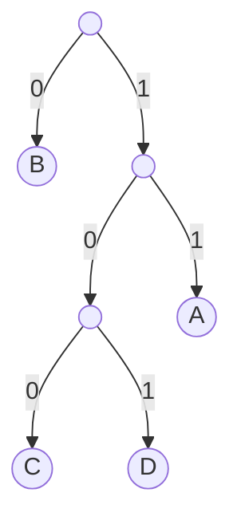
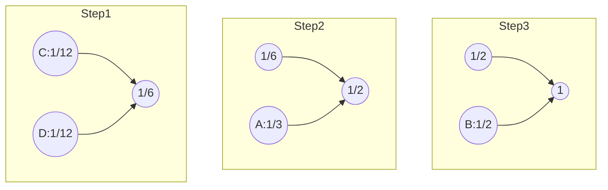
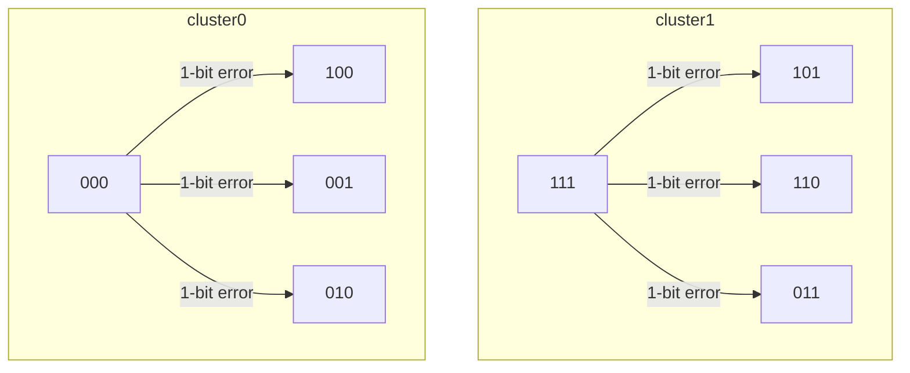
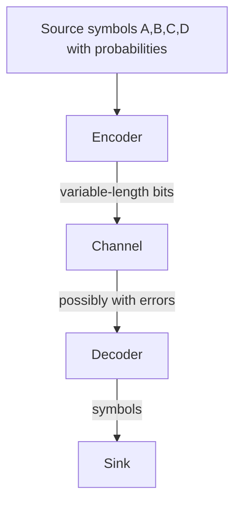
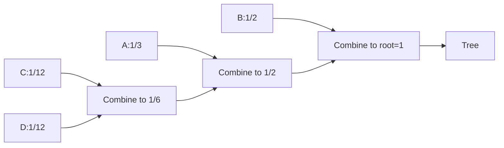

> [!INFO] Course: 6.004 Computation Structures · Spring 2017 · Instructor: Chris Terman

---

## 0. Obsidian Knowledge Scaffolding
**Tags:** #Mode/Alpha #Course/ComputationStructures #Status/Processed

### Learning Objectives
- **Define** information as the resolution of uncertainty and **quantify** it using $\log_2 (1/p)$.
- **Compute** entropy $H(X)$ for a discrete random variable and **interpret** it as the minimum average bits per symbol.
- **Design** fixed‑length and variable‑length encodings (including Huffman trees) and **evaluate** their expected lengths.
- **Apply** Hamming distance to **detect** and **correct** single‑bit errors in binary codewords.

### Prerequisites
- [[Probability Basics]] (discrete probability, expected value)
- [[Binary Numbers]] (unsigned and two’s complement representation)
- [[Digital Abstraction]] (voltage thresholds → 0/1)

### Synthesis Question (Cross‑Course)
*How does the entropy lower bound for lossless source coding connect to the **channel capacity** $C = B \log_2(1 + \text{SNR})$ from communication theory?*  
(Hint: Shannon’s source–channel separation theorem.)

---

## 1. Prediction & Executive Summary

### Prediction Prompt (fill *before* studying)
- **What do you think this topic is about?** information, entropy, huffman's tree, and hamming distance information something
- **What will be difficult?** applying the topics learned to efficiently use memories
- **Confidence (0–100%)** 80%

### Executive Summary
1. Information measures how much uncertainty is resolved by an observation; the more surprising the event, the more bits it carries.
2. Shannon’s formula $I = \log_2(1/p)$ gives information in bits; for equally likely outcomes it simplifies to $\log_2(N/M)$.
3. Entropy $H(X)$ is the expected information content and a **hard lower bound** on the average number of bits needed to encode symbols from the source.
4. Unambiguous encodings correspond to binary trees; fixed‑length codes are simple but inefficient when symbol probabilities are unequal.
5. Huffman’s algorithm builds an optimal variable‑length code for single symbols, while modern compressors (LZW) adapt to sequences.
6. By separating valid codewords by a **Hamming distance** of at least $E+1$ we detect $E$ errors, and by $2E+1$ we can correct $E$ errors; parity is the simplest detection scheme.

**Thesis:** A digital system can represent information compactly and reliably only if we engineer both the **statistical structure** of the source (entropy) and the **geometric separation** of encoded codewords (Hamming distance).

---

## 2. Micro‑Chunked Breakdown

### 2.1 What is Information?
- **Definition (engineering perspective):** *Information = data that resolves uncertainty about a fact.*
- **Intuition test (card deck):** 52 cards → four possible messages.
  - “Suit is Hearts” → 13 cards left
  - “Not the Ace of Spades” → 51 cards left
  - “Face card (J,Q,K)” → 12 cards left
  - “Suicide king (king of hearts) ” → 1 card (certainty)

| Data received | $p_{\text{data}}$ | $I = \log_2(1/p)$ | Interpretation          |
| :-----------: | :---------------: | :---------------: | :---------------------- |
|     Heart     |    13/52 = 1/4    |      2 bits       | Medium surprise         |
|   Not Ace♠    |   51/52 ≈ 0.98    |     0.03 bits     | Almost no information   |
|   Face card   |   12/52 = 3/13    |    ≈ 2.12 bits    | Slightly more than suit |
| Suicide king  |       1/52        |    ≈ 5.70 bits    | Maximum resolution      |

- **ELI5 Analogy:** Information is like the number of yes/no questions you need to ask to guess the outcome. Learning the card is a Heart answers two yes/no questions (“Is it red? Is it a heart?”). The Suicide King takes about 5.7 questions.

### 2.2 Quantifying Information (Shannon)
- **Random variable** $X \in \{x_1, …, x_N\}$ with probabilities $p_i$.
- **Self‑information:** $I(x_i) = \log_2 \frac{1}{p_i}$ bits.
- **Partial information:** If the data narrows $N$ equally likely choices to $M$, then
  $$I(\text{data}) = \log_2 \frac{1}{M(1/N)} = \log_2 \frac{N}{M}$$
- **Examples:**
  - Fair coin ($N=2, M=1$): $\log_2 2 = 1$ bit.
  - Suit of a card ($N=52, M=13$): $\log_2 4 = 2$ bits.
  - Two dice ($N=36, M=1$): $\log_2 36 \approx 5.17$ bits — **fractional bits** indicate the average over many rolls can approach 5.17 bits/roll.

> [!CAUTION]+ Common Misconception **“Fractional bits mean we must transmit a fraction of a bit.”**  
> A single outcome requires a whole number of bits (e.g., 6 bits for 36 possibilities). The fraction only appears when we average over many independent trials — it shows that a clever encoding can use fewer than 6 bits/roll on average.

- **Logic Invariant:** $I(x_i) \ge 0$ always; information is zero only when $p_i = 1$ (no uncertainty).  
- **Data Caveats:** $\log_2(1/p)$ assumes we know the exact probabilities. If probabilities are misestimated, the information measure is incorrect.

### 2.3 Entropy: Expected Information Content
$$ H(X) = \sum_i p_i \log_2 \frac{1}{p_i} $$
- **Weighted average** of the self‑information.
- **Example:** $X = \{A,B,C,D\}$ with probabilities $(1/3, 1/2, 1/12, 1/12)$.
  - $I(A) = \log_2 3 \approx 1.585$,
  - $I(B) = \log_2 2 = 1$,
  - $I(C)=I(D)=\log_2 12 \approx 3.585$.
  - $H(X) = (1/3)(1.585) + (1/2)(1) + 2\!\cdot\!(1/12)(3.585) = 1.626$ bits.
- **Meaning:** If we use **less than** $H$ bits/symbol on average, we *lose* information (ambiguity). If we use **more**, we *waste* resources. $H$ is the **golden mean**.
- **Theorist’s Note (unverified):** Some textbooks call $H$ the *uncertainty* of the source; it is maximal when all symbols are equally likely.

### 2.4 Encodings: From Symbols to Bit Strings
- **Encoding:** an *unambiguous* mapping between symbols and bit strings.
- **Binary tree representation:**
  - Symbols only at **leaves**.
  - Path from root to leaf gives the codeword (0 = left, 1 = right).


*Figure 1: Variable‑length code tree. Decoding “01111” → “B” (0), then “A” (11), then “A” (11) → “BAA”.*

- **Priority Filter:** High Yield (everything in digital systems is encoded; the tree idea is fundamental for decoders).

### 2.5 Fixed‑Length Encodings
- **When to use:** symbols **equally probable** (or no prior knowledge).
- **Length:** $\lceil \log_2 N \rceil$ bits for $N$ symbols.
  - **BCD:** 10 digits → 4 bits, entropy = $\log_2 10 \approx 3.322$ bits → 4‑bit code is 0.678 bits/symbol above entropy.
  - **ASCII:** 94 printable characters → 7 bits, entropy = $\log_2 94 \approx 6.555$ bits.

#### Unsigned Integers
- **Base‑2 positional notation:** $\sum_{k=0}^{N-1} b_k 2^k$.
- **Range:** $0$ to $2^N-1$.

#### Hexadecimal Notation
- Group bits by 4, starting from LSB.
- 16 hex digits: 0–9, A–F.
- Prefix **0x** (e.g., `0x7D0` = `0111 1101 0000`).

#### Signed Integers: Two’s Complement
- **Weight:** high‑order bit has weight $-2^{N-1}$.
- **Range:** $[-2^{N-1},\, 2^{N-1}-1]$ (for $N=8$: $[-128,127]$).
- **Negation:** bitwise complement $+ 1$.
- **Addition:** use normal binary adder; the same circuit works for both unsigned and signed.

> [!CAUTION]+ Common Misconception
> **“Two’s complement negation always works.”**  
> The most negative number ($-2^{N-1}$) has no positive counterpart in $N$ bits. Attempting negation (flip+1) yields the same bit pattern — an overflow condition that must be flagged.

- **Logic Invariant:** $A + (-A) = 0$ in N‑bit arithmetic, with overflow ignored.

- **Priority Filter:** High Yield — all modern processors use two’s complement.

### 2.6 Variable‑Length Encodings
- **Idea:** shorter codes for more probable (less informative) symbols.
- **Expected length:** $L = \sum_i p_i \cdot \text{len}(x_i)$.
- **Example (from 2.3):** A: `11` (len 2), B: `0` (len 1), C: `100`, D: `101` (len 3).
  $$L = \frac13\!\cdot\!2 + \frac12\!\cdot\!1 + \frac{1}{12}\!\cdot\!3 + \frac{1}{12}\!\cdot\!3 = \frac{5}{3} \approx 1.667\ \text{bits}$$
  Entropy $H = 1.626$ bits → this code is close to optimal but not perfect.

- **Decoding:** use the binary tree — never ambiguous as long as no codeword is a prefix of another.
- **Priority Filter:** High Yield — foundation for compression, network protocols.

### 2.7 Huffman’s Algorithm (Optimal Variable‑Length Code)
- **Procedure (bottom‑up):**
  1. Start with symbols as leaf nodes, each with their probability.
  2. Repeatedly pick two nodes with **smallest probabilities**, create a new internal node with probability equal to their sum.
  3. The final tree is the Huffman tree; labels on branches (0/1) can be arbitrary but symmetric trees give identical expected length.


*Figure 2: Huffman tree construction.*

- **“Optimal”** refers to single‑symbol encoding only. Encoding **pairs** of symbols reduces expected bits/symbol further (e.g., 1.646 bits). Modern compressors (LZW) adapt to recurring sequences.

- **Priority Filter:** Medium Yield — understanding the principle is essential; implementing Huffman by hand is less common today, but the greedy algorithm concept appears in many places (e.g., [[Minimum Spanning Tree]]).

### 2.8 Error Detection and Correction
- **Problem:** noise flips a bit. If valid codewords have Hamming distance 1, a single error changes one valid codeword into another — **undetectable**.
- **Hamming distance:** number of bit positions where two codewords differ.
- **Detection rule:** minimum distance $d_{\min} \ge E+1$ guarantees detection of up to $E$ errors.
- **Parity (single‑bit detection):** add a bit so that total number of 1’s is even.
  - Original: `0` (heads) → `00`, `1` (tails) → `11`. $d_{\min}=2$, so single‑bit error yields a non‑codeword (odd parity) → **detectable**.
  - Parity check: XOR all bits → 1 indicates error.
- **Correction rule:** $d_{\min} \ge 2E+1$ to correct up to $E$ errors.
  - Example: codewords `000` and `111` ($d_{\min}=3$). A single error yields `001,010,100` (from `000`) or `110,101,011` (from `111`). The sets are disjoint → we can **correct** assuming at most 1 error.


*Figure 3: Single‑bit error spheres around codewords 000 and 111 do not intersect, enabling correction.*

- **Logic Invariant:** For a linear code, the minimum distance equals the minimum weight of a non‑zero codeword, which is the basis for algebraic error‑correcting codes (Reed–Solomon, Hamming codes).

> [!CAUTION]+ Common Misconception
> **“Parity can detect any single error, so it’s sufficient.”**  
> Parity fails for an even number of errors (e.g., two bit‑flips keep parity even). It provides no correction capability.

- **Priority Filter:** High Yield — error detection/correction is used in RAM, networks, storage (ECC memory, CRC, etc.).

### Gap Handling
- ⚠️ **Clarification Needed:** The lecture alludes to “LZW” compression but does not detail the algorithm. Instructor may provide additional handouts or this is a teaser for later courses. Not critical for the exam.

---

## 3. Reference Tables

### Concept Table
| Term | Plain English Definition | Technical / Why It Matters | Interdisciplinary Link |
|:---:|:---|:---|:---|
| **Information** | Surprise value of an outcome | $I = \log_2 (1/p)$ bits; quantifies uncertainty reduction | Communication theory (Shannon) |
| **Entropy** | Average information per symbol | $H(X) = -\sum p_i \log_2 p_i$; minimum bits/symbol for lossless encoding | Statistical mechanics (Boltzmann) |
| **Fixed‑length encoding** | Every symbol gets the same number of bits | Simple, supports random access; inefficient for skewed distributions | Character encodings (ASCII) |
| **Variable‑length encoding** | Short codes for frequent symbols, long for rare ones | Reduces expected length; requires prefix‑free condition | Huffman coding, Morse code |
| **Huffman’s algorithm** | Greedy bottom‑up tree building | Produces an optimal prefix code for given probabilities | File compression (ZIP, JPEG) |
| **Two’s complement** | Signed number representation with negative weight on MSB | Enables same adder for signed/unsigned; no ±0 ambiguity | Processor ALU design |
| **Hamming distance** | Number of differing bits between two codewords | Determines error detection/correction capability | Coding theory, DNA sequence alignment |
| **Parity bit** | Extra bit to make total 1’s even (or odd) | Increases minimum distance to 2 → detects single‑bit errors | RAM, UART, RAID |

### Symbol Table
| Symbol | Meaning | Units | Typical Value |
|:---:|:---|:---|:---|
| $X$ | Discrete random variable (source) | – | e.g., $\{A,B,C,D\}$ |
| $p_i$ | Probability of value $x_i$ | dimensionless, $0\le p_i\le 1$ | – |
| $I(x_i)$ | Self‑information of $x_i$ | bits | $\log_2(1/p_i)$ |
| $H(X)$ | Entropy of source $X$ | bits/symbol | max $\log_2 N$ |
| $N$ | Number of equally likely choices | – | 2, 4, 52, … |
| $d_{\min}$ | Minimum Hamming distance | bits | 1 (no detection) → 3 (correct 1) |
| $N$-bit | Number of bits in fixed‑size representation | bits | 8, 16, 32, 64 |

---

## 4. Active Recall (Anki‑style)

~~~csv
Question,Answer,Tags
"Define information in the engineering sense.","Data communicated that resolves uncertainty about a fact.","#Alpha #Definition"
"Compute I(heart) when a random card is drawn and you learn it is a Heart.","I = log2(52/13) = log2(4) = 2 bits.","#Alpha #Calculation"
"What does a fractional information content (e.g., 5.17 bits for two dice) actually mean?","A single outcome requires a whole number of bits, but over many trials the average bits per outcome can approach 5.17.","#Alpha #Concept"
"Given probabilities: A=1/3, B=1/2, C=1/12, D=1/12, compute H(X).","H = (1/3)·log2(3) + (1/2)·log2(2) + 2·(1/12)·log2(12) ≈ 1.626 bits.","#Alpha #Calculation"
"Why is a fixed‑length 4‑bit code for decimal digits (BCD) inefficient?","Because entropy of a decimal digit is log2(10) ≈ 3.322 bits; 4 bits is above the lower bound, wasting ~0.678 bits/digit.","#Alpha #Efficiency"
"Explain two's complement negation of the number -128 (8 bits).","-128 is 1000 0000. Flip bits → 0111 1111, add 1 → 1000 0000, which is -128 again — overflow!","#Alpha #FailureMode"
"How does a binary tree guarantee an encoding is unambiguous?","Symbols are only at leaves, so no codeword is a prefix of another; every bit path leads to a unique symbol.","#Alpha #Structure"
"What is the minimum Hamming distance needed to correct 2 bit errors?","2E+1 = 5, so d_min must be at least 5.","#Alpha #Calculation"
"Design a code with 4 codewords that can detect any single-bit error.","Start with 2 bits per codeword, then add even parity: e.g., 00→000, 01→011, 10→101, 11→110. Minimum distance = 2 → detects 1 error.","#Alpha #Application"
"Teach‑it‑back: Explain entropy to a friend using a weather forecast analogy.","Suppose a forecast says '80% chance of rain' vs '20% chance'. The first gives little surprise — rain is likely, so low information. The second, if it rains, is very surprising — high information. Entropy is the average surprise per day, telling us how many bits we'd need on average to communicate the actual weather if we designed the perfect shorthand.","#Alpha #ELI5"
~~~

---

## 5. Visual Traces

### 5.1 Encoding / Decoding Flow

*Figure 4: Abstract communication model.*

### 5.2 Huffman Tree Evolution (Simplified)

*Figure 5: High‑level Huffman steps (actual binary labels omitted).*

---

## 6. Core Compression (MANDATORY)

- **1 Core Idea** *[User fills in]*  
  *Hint: It’s about balancing surprise, compression, and error resilience through mathematics.*

- **1 Anchor Representation** *[User fills in]*  
  *Hint: What equations or diagrams would you scribble on a napkin to recall the entire lecture? (e.g., $H(X) = -\sum p_i \log_2 p_i$, the binary tree, the Hamming distance spheres)*

- **1 Critical Mistake** *[User fills in]*  
  *Hint: If you confuse Hamming distance with Euclidean distance, or think parity corrects errors, what breaks?*

---

## 7. Gamma Layer (Opportunity Architect)

*Activated: Core Compression is sketched; no major unresolved gaps.*

### Pain Point
In many embedded or legacy systems, **fixed‑length encodings are used even when symbol frequencies are highly skewed** (e.g., fixed instruction lengths in a CPU with opcode usage varying widely). This wastes memory, bandwidth, and power.

### Bottleneck
Manual selection of an encoding scheme often relies on “engineering intuition” rather than a quick entropy analysis. The **gap between entropy and actual encoding** is rarely measured, leading to bloated firmware or inefficient network protocols.

### Automation Potential
- **Build a design‑time tool** that profiles opcode or data usage frequencies (from logs/simulations) and automatically suggests a variable‑length encoding (Huffman or arithmetic) and estimates the savings in code size or transmission time.
- **Integrate an entropy‑based code review** into CI/CD pipelines for communication protocols, flagging structs with fixed‑width fields where a variable‑length format would shrink packets.

### Leverage Score: 8/10
Compression benefits are direct (smaller binaries, faster transmission, less energy). The tool would require only basic statistical analysis and could produce concrete “before vs. after” metrics for managers.

### Build Hooks
1. **“Entropy‑Driven Code Compactor”** – a GCC/LLVM plugin that, given training workloads, selects a mix of Thumb/ARM instructions (or inserts a lightweight decompressor) to minimize final binary size.
2. **“Protocol Diet Analyzer”** – a Wireshark‑like post‑processor that computes entropy of transmitted fields and recommends a variable‑length serialization (e.g., Protobuf vs. fixed‑size structs).

### Why Hasn’t This Been Solved?
- Many teams prioritize **simplicity and deterministic timing** over size; fixed‑width fields are easier to parse in hardware.
- Lack of awareness: entropy is taught in theory but rarely applied in routine system design. Tools like `gzip` exist for storage, but not for real‑time embedded streams where the encoding could be tuned to the exact data distribution.

---

## 8. Post‑Study Hook

*After reviewing this note, answer for yourself:*

- **What still feels unclear?** *[User fills in]*
- **Can you explain the difference between information and entropy without looking?** *[User fills in]*
- **Where would you hesitate when designing an error‑correcting code for a noisy link?** *[User fills in]*

*Then, run the **Reality Auditor** below.*

---

# REALITY AUDITOR (Separate prompt — use AFTER studying)

## My Experience:
- **What felt easy:** *[User fills in]*
- **What felt confusing:** *[User fills in]*
- **What I got wrong:** *[User fills in]*
- **Time spent:** *[User fills in]*

## Transcript + in‑class notes:
*MIT 6.004, Spring 2017, “1.1 Annotated Slides” – Basics of Information*

## Auditor Tasks:

1. **Mismatch Detection:** Did any summary or calculation in the processed note contradict what was taught? *[User fills in]*

2. **Failure Point Analysis:** Which single concept, if misunderstood, would cause a cascade of errors in later topics? *[User fills in]*

3. **Hidden Assumptions:** What unspoken assumptions (e.g., memoryless source, independent errors) underlie the entropy and Hamming distance results? *[User fills in]*

4. **Targeted Fixes (2–3 max):** 
   - *[User fills in, e.g., re‑read two’s complement boundary case]*
   - *[User fills in]*

5. **Re‑Compression (sharpen core idea):**  
   After this review, how would you restate the entire lecture in **one sentence** that you can never forget? *[User fills in]*
```
